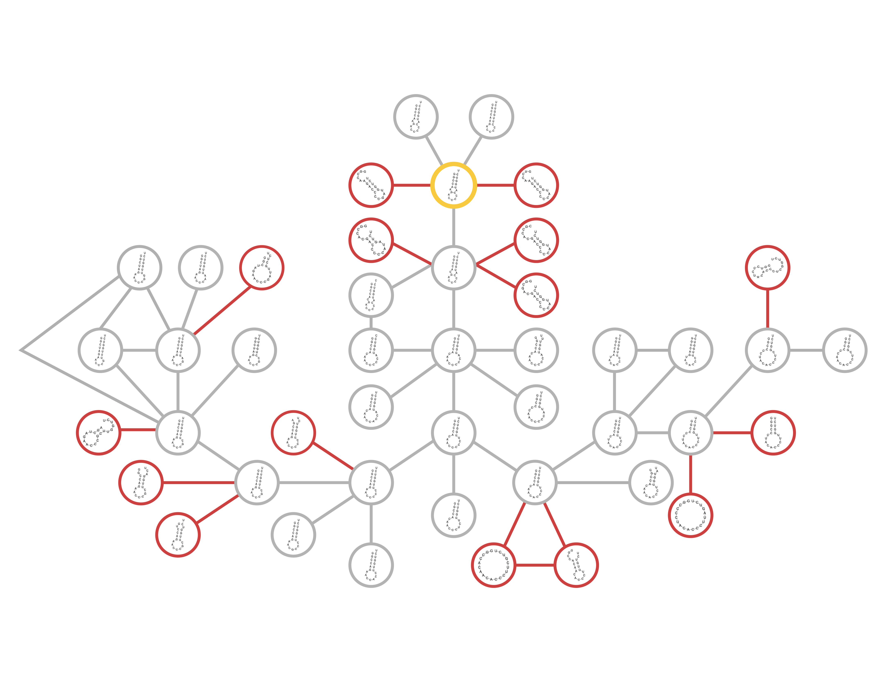

## Ata Kalirad, PhD

I am currently  a Postdoctoral researcher at [Max-Planck-Institut für Entwicklungsbiologie](). 

[My résumé.](Kalirad_CV_2021.pdf)

Below, I describe some of the biological phenomena that I have found deeply fascinating over the years and my attempts to contribute to our scientific understanding of them. 

### The dynamics of genetic incompatibilities

During my PhD, I became fascinated by how genetic incompatibilities accumulate between diverging lineages. This biological question has had a long history; even Darwin was puzzled by the existence of sterile hybrids between different species. Why would natural selection allow the production of sterile hybrids? 

Genetic incompatibilities provide one answer to this puzzle: beneficial or neutral mutations can fix during divergence of two populations and these mutations could turn out to be incompatible - i.e., result in inviable or sterile offspring - when brought together. A famous example of a genetic incompatiblity is a simple DM incompatibility between *D. melanogaster* and *D. simulans.* The two derived versions of ancestral alleles, *Lhr* and *Hmr*, which are located at different loci, are functional in *D. simulans* and *D. melanogaster* respectively, but are deleterious when brought together in the hybrid.

(Image from *Kalirad (2016), A Test of the Snowball Model, Published ETD Collection, University of Houston*)

During my PhD, I tried to extend the theoretical framework in which incompatibilities are studied. Our approach is based on a model RNA secondary structure (specifically, [the ViennaRNA package](https://www.tbi.univie.ac.at/RNA/)): We randomly generate a RNA sequence, then use it as our yardstick to measure the fitness of other RNA sequences in that genotypic landscape. If the secondary structure of a RNA sequences *i* is close enough to the structure of our yardstick, within a given threshold, we consider *i* to be viable. In our "holey" fitness landscape, there are only viable and inviable genotypes. Figure below depicts a portion of such landscape, where the reference RNA sequence - our yardstick - is in a yellow circle, inviable sequences are in red, and viable ones in grey circles.

We then used this landscape to see how incompatibilities accumulate during divergence. In Orr's [original paper](https://www.genetics.org/content/139/4/1805.short), he assumes that genetic incompatibilities of different order - i.e., those that involve two loci, versus those that involve many more loci - accumulate independently of each other, and, once a genetic incompatibility arises, it will linger. Our simulations show that, at least in a highly-epistatic system, the order of incompatibilities can change over time. For example, an incompatibility involving two loci might later involve three or more loci or simply disappear. 

We modified Orr's original model. Our new model, christened as *the spiraling complexity* model (B), includes conversions of incompatibilities of different orders into one another, while Orr's original (A), assumes that these incompatibilities arise independently. 

For a through description of our model, check out the paper in [*Genetics*]((kalirad17a.pdf)), written in collaboration with my former PI, the inimitable Ricardo Azevedo. 

